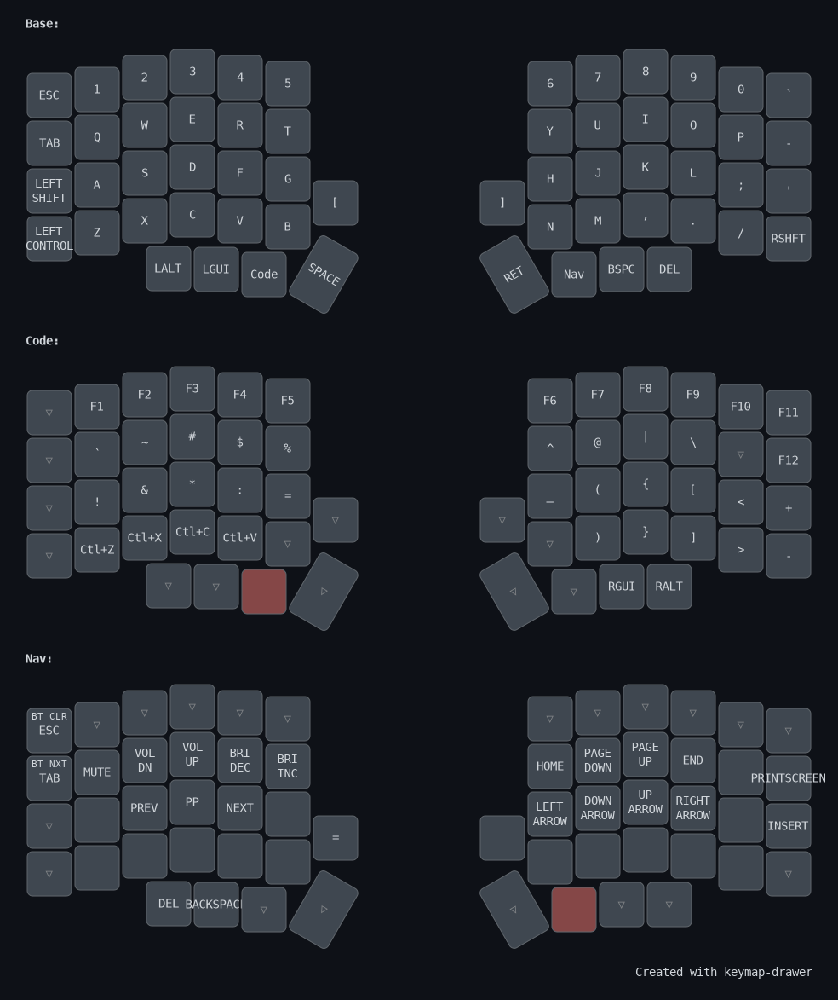

# ZMK Config — Lily58

Конфигурация прошивки [ZMK](https://zmk.dev/) для сплит-клавиатуры **Lily58** на контроллерах **nice!nano v2**.

## ⌨️ Раскладка



> **Home-row modifiers** — удержание `A/S/D/F` даёт `GUI/Alt/Ctrl/Shift`, `J/K/L/;` — `Shift/Ctrl/Alt/GUI`; тап печатает букву. Модификатор активируется при сочетании с клавишей противоположной руки.
>
> **⇧BCLR** — Nav + Shift + ESC = BT Clear (без Shift = ESC)
> **⇧BNXT** — Nav + Shift + TAB = BT Next (без Shift = TAB)
>
> ⚠️ PNG может быть неактуальным — перегенерируй через [keymap-drawer](https://github.com/caksoylar/keymap-drawer) после изменений в keymap.

## ⚡ Особенности

- **Vim-навигация** — стрелки на HJKL (Nav layer)
- **Безопасный Bluetooth** — BT Clear и BT Next требуют удержания Shift (mod-morph)
- **Мультимедиа** — громкость, яркость, управление плеером на Nav layer
- **Num layer** — удержание правого `Del` открывает цифровой блок `789/456/123/0` под левой рукой; тап по клавише по-прежнему отправляет Delete
- **Mouse layer** — удержание левого thumb `GUI` открывает мышь: курсор на `HJKL`, скролл на `YUIO`, клики на `;/'/P`
- **Оптимизация для кода** — `:=`, `()`, `{}`, `<>`, `?`, `|` и `\\` удобно расположены на Code layer
- **Ctrl+Z/X/C/V** — undo/cut/copy/paste одной рукой на Code layer
- **Home-row modifiers** — Ctrl/Alt/Shift/GUI доступны с домашнего ряда без ухода к нижнему краю
- **ZMK Studio** — можно менять раскладку без перепрошивки (3 reserved слоя)
- **OLED дисплей** — показывает слой, батарею, WPM

## 🔧 Конфигурация

| Параметр | Значение |
|---|---|
| Контроллер | nice!nano v2 |
| Дисплей | OLED (battery, layer, WPM) |
| BT мощность | +8 dBm (максимум) |
| Debounce | 1ms press / 10ms release |
| ZMK Studio | включён, без блокировки |
| Home-row modifiers | balanced hold-tap: 280 мс, prior idle 150 мс |
| Num layer | hold правого `Del`, tap = Delete |
| Mouse layer | hold левого thumb `GUI` |

## 🏗️ Сборка

Прошивка собирается автоматически через GitHub Actions при каждом push.

1. Сделать push в репозиторий
2. Перейти в **Actions** → последний workflow run
3. Скачать артефакт `firmware`
4. Прошить каждую половинку:
   - Подключить USB
   - Дважды нажать reset на nice!nano
   - Скопировать `.uf2` файл на появившийся диск

## 📁 Структура

```
zmk-config/
├── .github/workflows/build.yml  ← CI сборка прошивки
├── config/
│   ├── lily58.keymap            ← раскладка клавиш
│   ├── lily58.conf              ← конфигурация фич
│   └── west.yml                 ← манифест ZMK/Zephyr
├── boards/shields/              ← кастомные шилды (пусто)
├── build.yaml                   ← матрица сборки
└── build/                       ← локальные артефакты
```
